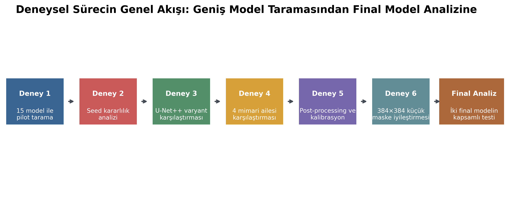
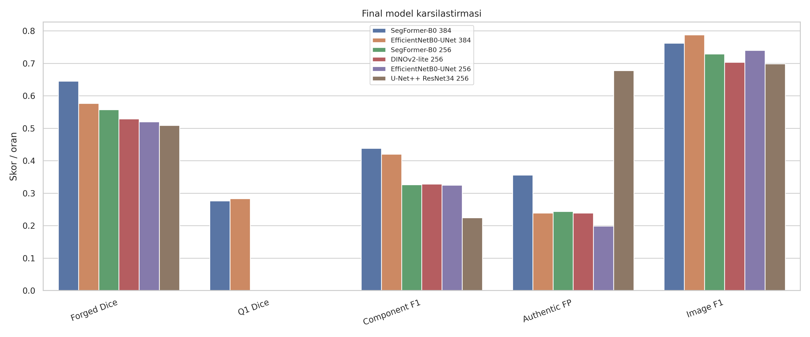
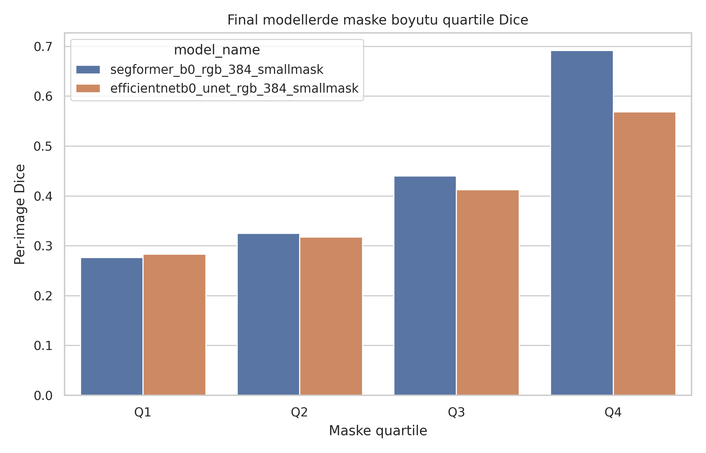

# Scientific Image Forgery Detection

Reproducible deep-learning experiments for detecting and localizing copy-move manipulation in biomedical research images. The project was developed for the **Recod.ai/LUC Scientific Image Forgery Detection** dataset and evaluates both pixel-level localization and image-level forgery detection.

The repository is a GitHub-ready archive of the graduation project. Source code, clean notebooks, exact split manifests, detailed experiment tables, final plots and reports, and the two selected final model checkpoints are retained. Redistributable datasets, raw probability tensors, superseded checkpoints, and repeated working folders are intentionally excluded.

## Highlights

- Leakage-safe train/validation/test splits grouped by image identity.
- TensorFlow/Keras and PyTorch implementations in one reusable pipeline.
- Broad screening across U-Net variants, SegFormer, DeepLabv3+, DINOv2-lite, ManTraNet, MVSSNet, BusterNet, CMFDFormer, and other forensic baselines.
- Validation-only threshold selection and post-processing calibration.
- Final robustness, bootstrap confidence interval, small-mask quartile, component-level, and failure-case analyses.
- Kaggle- and Colab-compatible experiment notebooks.

## Final results

Two complementary 384×384 models were retained because localization quality and false-alarm control lead to different operational choices.

| Model | Intended role | Forged Dice | Forged IoU | Q1 Dice | Authentic FP rate | Image F1 | ROC-AUC |
|---|---|---:|---:|---:|---:|---:|---:|
| SegFormer-B0 | Localization-oriented | 0.6451 | 0.4761 | 0.2767 | 0.3559 | 0.7620 | 0.8503 |
| EfficientNetB0-UNet | Conservative / low false alarm | 0.5770 | 0.4055 | 0.2833 | 0.2394 | 0.7878 | 0.8616 |

Thresholds and post-processing settings were selected on the validation split and then kept fixed for the test evaluation. See [`results/final/final_model_comparison.md`](results/final/final_model_comparison.md) and [`docs/final_experimental_report.md`](docs/final_experimental_report.md) for the full analysis.

## Visual overview

The study progressively narrows a broad architecture screening into a controlled comparison, post-processing study, higher-resolution small-mask experiment, and final robustness analysis.



The final candidates expose a clear operational trade-off: SegFormer-B0 leads localization metrics, while EfficientNetB0-UNet provides stronger false-alarm control and image-level performance.



Small forged regions remain the hardest cases, although 384×384 training substantially improves the Q1 and Q2 groups.



## Repository structure

```text
.
├── src/luc_forgery_pipeline/   # Reusable data, model, training and evaluation code
├── scripts/                    # CLI entry points for model families and comparisons
├── experiments/                # Standalone Kaggle/Colab experiment programs
├── notebooks/                  # Output-free notebooks ordered by study stage
├── artifacts/checkpoints/      # Two selected final model weights and configs
├── results/
│   ├── eda/                    # Dataset summary tables
│   ├── experiments/            # Detailed CSV/JSON/Markdown results for experiments 2–6
│   ├── splits/                 # Exact seed-42 full-data split manifests
│   └── final/                  # Final metrics, per-image details, tests and plots
└── docs/
    ├── workflows/              # Step-by-step records for experiments 1–6
    └── final_experimental_report.md
```

## Dataset

The data is not redistributed in this repository. Download or attach the [Recod.ai/LUC Scientific Image Forgery Detection competition data](https://www.kaggle.com/competitions/recodai-luc-scientific-image-forgery-detection) and arrange it as follows:

```text
dataset/
├── train_images/
│   ├── authentic/
│   └── forged/
├── train_masks/
├── test_images/
└── sample_submission.csv
```

Forged images use binary ground-truth masks; authentic images are represented by zero masks during training and evaluation.

## Installation

Python 3.10 or newer is recommended. The final analysis was executed with Python 3.12, PyTorch 2.10, CUDA 12.8, and an NVIDIA Tesla T4.

```bash
python -m venv .venv
```

Linux/macOS:

```bash
source .venv/bin/activate
pip install -r requirements.txt
pip install -e .
```

Windows PowerShell:

```powershell
.venv\Scripts\Activate.ps1
pip install -r requirements.txt
pip install -e .
```

GPU builds of TensorFlow or PyTorch may require platform-specific installation steps.

## Running the modular pipeline

Prepare the shared split files:

```bash
python scripts/prepare_splits.py --dataset-root /path/to/dataset --output-root outputs
```

Run the initial TensorFlow models on the default balanced pilot subset:

```bash
python scripts/run_first3_models.py --dataset-root /path/to/dataset --output-root outputs
```

Run the PyTorch and forensic model groups:

```bash
python scripts/run_next3_torch_models.py --dataset-root /path/to/dataset --output-root outputs
python scripts/run_forensic_torch_models.py --dataset-root /path/to/dataset --output-root outputs
python scripts/run_copymove_torch_models.py --dataset-root /path/to/dataset --output-root outputs
python scripts/run_final_cmfd_models.py --dataset-root /path/to/dataset --output-root outputs
```

Use `--help` on each script for the supported dataset, output, seed, subset, and model options. The stage-specific notebooks in [`notebooks/`](notebooks/) include path discovery for common Kaggle and Google Colab layouts.

## Experimental sequence

1. Screening of 15 model families on a balanced 300-authentic/300-forged pilot subset.
2. Three-seed stability analysis for shortlisted models.
3. Full-dataset U-Net++ analysis.
4. Controlled comparison of four architecture families.
5. Validation-only calibration and post-processing optimization.
6. 384×384 small-mask localization study.
7. Final clean-test, robustness, statistical, and failure-case evaluation of the two selected models.

The complete narrative and limitations are documented in [`docs/final_experimental_report.md`](docs/final_experimental_report.md).

## Reproducibility notes

- The main full-data split uses seed 42 and contains 3,590 training, 515 validation, and 1,023 test images.
- No image identity overlaps between these splits.
- The selected SegFormer-B0 and EfficientNetB0-UNet weights are preserved under [`artifacts/checkpoints/`](artifacts/checkpoints/), together with their configs and SHA-256 checksums.
- Exact split membership is preserved under [`results/splits/full_seed42/`](results/splits/full_seed42/).
- Detailed experiment results are preserved under [`results/experiments/`](results/experiments/), with final per-image and robustness tables under [`results/final/detailed/`](results/final/detailed/).
- The notebooks contain no execution outputs or embedded credentials.

See [`ARCHIVE_MANIFEST.md`](ARCHIVE_MANIFEST.md) for the deletion-safety audit, artifact hashes, and the explicit list of large reproducible files that were not archived.

## Scope and limitations

This is a research prototype, not a production forensic decision system. Results are specific to the Recod.ai/LUC copy-move benchmark. External-dataset validation, calibration under distribution shift, and human-review integration remain future work.
